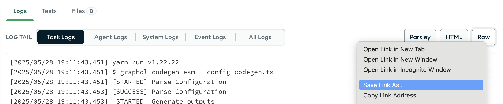
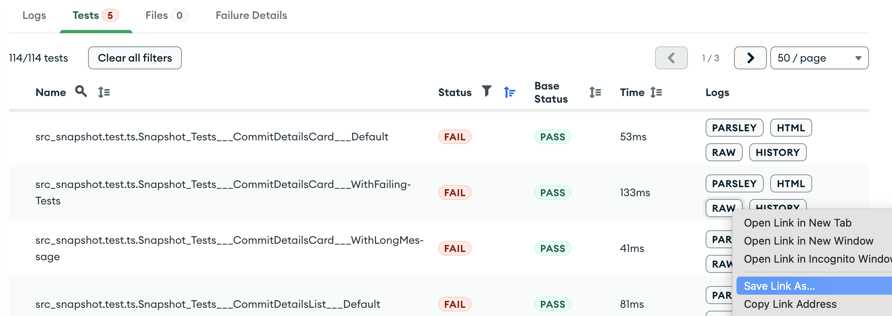

# Downloading Logs

There are several ways to download Parsley logs. Downloading logs may be necessary if your task produces particularly large logs, as Parsley is only able to process logs up to a size of 2.5GB.

Note that there is a 1 minute timeout on log downloads. If you find that your downloads are terminating after a minute, it's likely that the log was only partially downloaded.

The methods listed below are ordered from most to least recommended. We recommend going through these methods sequentially if you are running into issues fetching your logs.

## Via Evergreen CLI

You can use the following commands with the `evergreen` client to fetch task and test logs.

### Task Logs

```properties
evergreen task build TaskLogs --task_id <task_id> --execution <execution> --type <task_log_type>  --o output.txt
```

See other options using the following command:

```properties
evergreen task build TaskLogs --help
```

### Test Logs

```properties
evergreen task build TestLogs --task_id <task_id> --execution <execution> --log_path <test_log_path> --o output.txt
```

See other options using the following command:

```properties
evergreen task build TestLogs --help
```

To find the correct value for `<test_log_path>`, we recommend viewing `https://evergreen.corp.mongodb.com/rest/v2/tasks/<task_id>/tests` ([docs](https://docs.devprod.prod.corp.mongodb.com/evergreen/API/REST-V2-Usage#tag/tests/paths/~1tasks~1%7Btask_id%7D~1tests/get)) in your browser and using Ctrl + F to locate your test.

Please note that this endpoint will only show the first 100 tests by default; append the `?limit=<num>` query parameter to show more tests. The test log path can then be grabbed from the `logs.url` field which should contain some value `test_name=<this_is_the_test_log_path>`.

## Via Spruce

Right click the "Raw" button and select the "Save Link As..." option. This will save the logs as a `.txt` file.

### Task Logs



### Test Logs



## Via Rest API

Using our REST API, you can download the logs for a given task or test.

### Authentication

To authenticate your requests, please reference [this documentation](https://docs.devprod.prod.corp.mongodb.com/evergreen/API/Authentication).

### Task Logs

[Route documentation](https://docs.devprod.prod.corp.mongodb.com/evergreen/API/REST-V2-Usage#tag/tasks/paths/~1tasks~1%7Btask_id%7D~1build~1TaskLogs/get).

```bash
# With cURL
curl -H "Authorization: Bearer $(evergreen client get-oauth-token)" https://evergreen.corp.mongodb.com/rest/v2/tasks/<task_id>/build/TaskLogs -o output.txt

# With wget
wget --header="Authorization: Bearer $(evergreen client get-oauth-token)" https://evergreen.corp.mongodb.com/rest/v2/tasks/<task_id>/build/TaskLogs -O output.txt
```

> Note, your session may be expired. You should run `evergreen login` to refresh your session before running the above commands.

### Test Logs

[Route documentation](https://docs.devprod.prod.corp.mongodb.com/evergreen/API/REST-V2-Usage#tag/tasks/paths/~1tasks~1%7Btask_id%7D~1build~1TestLogs~1%7Bpath%7D/get).

```bash
# With cURL
curl -H "Authorization: Bearer $(evergreen client get-oauth-token)" https://evergreen.mongodb.com/rest/v2/tasks/<task_id>/build/TestLogs/<test_log_path> -o output.txt

# With wget
wget --header="Authorization: Bearer $(evergreen client get-oauth-token)" https://evergreen.mongodb.com/rest/v2/tasks/<task_id>/build/TestLogs/<test_log_path> -O output.txt
```

> Note, your session may be expired. You should run `evergreen login` to refresh your session before running the above commands.

## Via a Spawn Host

Spawn a host and try to download the logs using the commands for the terminal (shown in the previous section).

This method may work even if previous methods fail because file transfers via spawn hosts are typically faster. This means that you may be able grab the entire log before the 1 minute timeout kicks in.

## Ask for Help in a Public Channel

If you are still unable to download the full log, you will need to ask for assistance from the DevProd Infrastructure team so that they can manually fetch it for you.
